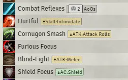
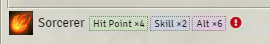
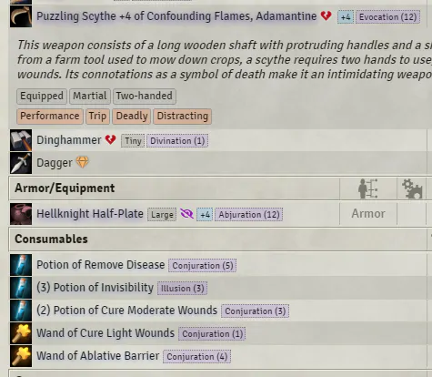
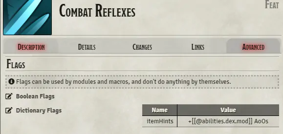
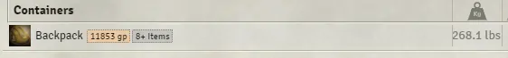
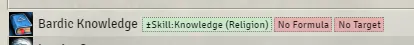
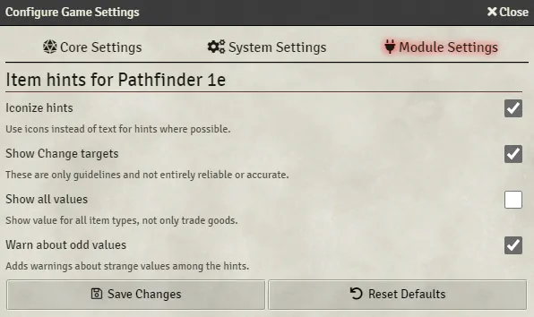

# Koboldworks – Item Hints for Pathfinder 1e

- Adds small item hints to most items (classes, feats, inventory, spells, buffs, etc.).
- Items have their broken status, enhancement bonus, aura, mismatched size, and unidentified status shown.
  - Only broken status is shown if not identified and not GM.
  - Damaged items show their health, replaced by broken indicator where appropriate.
- Nonlethal hint for items where the default action deals nonlethal damage.
- Feats and spells have their saving throw type (e.g. Reflex negates) stated if not harmless.
  - DC display.
- Magic items also have a glow from faint to strong based on caster level.
- Classes show FCB choices.
  - Unused FCB bonus notification for classes that have at least some FCB used.
- Some features can show a warning if they look suspect (too few FCB choices, too weak magic aura).
- Items with Changes or Context Notes now show basic ideas what these do.
- Spell material component detail icon is now shown.
- Custom hints.  
  - Shows hints stored in item flags.  
    - Multiple hints can be inserted by separating them with semicolon (`;`, e.g. `Note; +1 Feels`).  
    - Hints can have custom tooltip by separating the normal text with vertical bar (`Note|Does not work against murfolk.; +1 DMG|+2 if not damaged in last 1 minute.`)
    - Additional instructions can be provided with second vertical bar.
      - Only CSS selectors are possible with the instructions currently:  
        For example: `Bleeding Attack|Cause bleed equal to sneak attack dice|css=sneak-attack modifier no-stacking`
  - The item hints have access to rollData via inline rolls.
- Containers show value of their contents and number of items held.
- Spell school display as 3 letter key, icon, or Thassilonian rune.
  Note the runes do not include Divination nor Universal schools, and as such they were made to use Truth and Diligence runes instead.
- Changes that have not been fully configured will have tags warning about lacking formula or target.

  ✅ Recommended for general use

## Screenshots

Feat example:  


Class FCB example:  


Items example (GM view):  


Custom hint configuration example:  


Container example:  


Incomplete changes:  


## Configuration

Module settings:

- Iconize, uses icons instead of text where possible.
- Change target display, shows basic Change hints on many items.
- Show value for all items, displays gold value of all items instead of only tradegoods.
- Warn about odd values, tries to provide feedback about problems.



## Limitations

None known.

## API

Example usage:

```js
let itemHintsAPI;
const customHandler = (actor, item, data) => {
  const hintcls = itemHintsAPI.HintClass;
  const hint = hintcls.create("Label", ["css-selector"], {
    hint: "text", // tooltip
    icon:"fa-solid fa-star", // font awesome icon
    image: null, // actual image file URL as alternative to icon
    combo: true, // display both text and icon for this
  });
  return [hint]; // Array of hints
}

const ih = game.modules.get("mkah-pf1-item-hints");
if (ih.active) {
  const api = ih.api;
  itemHintsAPI = api;
  api.addHandler(customHandler);
}
```

## Compatibility issues

### PF1 Alt Sheet by Zenvy

The alt sheet includes a broken condition icon of its own, causing duplication.  
[Custom CSS](https://foundryvtt.com/packages/custom-css) can be used to avoid this:  

```css
.pf1alt.sheet itemhints .broken { display: none; }
```

## Interoperability

For full details, see the [interoperability documentation](./INTEROP.md).

## Install

Manifest URL: <https://gitlab.com/koboldworks/pf1/item-hints/-/releases/permalink/latest/downloads/module.json>

## Attribution

If you use any of the code in this project, I would appreciate I or the project was credited for inspiration or whatever where appropriate. Or just drop a line about using my code. I do not mind not having this, but it's just nice knowing something has come out of my efforts.

## Donations

[](https://ko-fi.com/I2I13O9VZ)

## License

This software is distributed under the [MIT License](./LICENSE).

## Credits

Uses icons from [game-icons.net](game-icons.net) distributed under Creative Commons license, individual credits in [CREDITS](./CREDITS.md)

Uses Thassilonian runes [from Paizo](https://paizo.com/products/btpy87fo?Community-Use-Package-Pathfinder-Runes) as available under the [Community Use Policy](https://paizo.com/community/communityuse) license.
